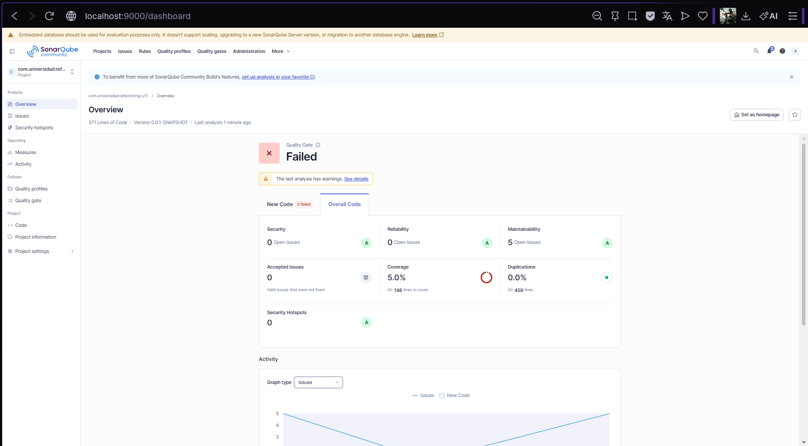
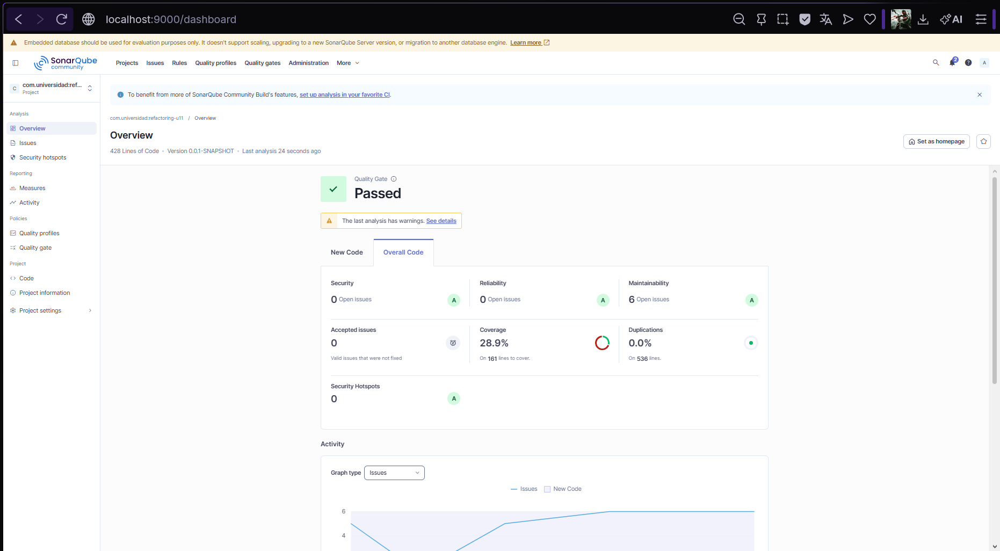

# Refactorización Avanzada: Condicionales y Clean Code

## Objetivo

Refactorizar condicionales complejos de alta complejidad ciclomática (CC) aplicando
**Replace Conditional with Polymorphism** y **Guard Clauses**, verificando con
SonarQube que la complejidad disminuye y el Quality Gate queda en estado Passed.

---

## Code Smells identificados

| Smell | Ubicación | Descripción |
|---|---|---|
| Switch Statement | `CreditoService.calcularEnvio()` | Switch con 4 casos + default, CC = 5 |
| Arrow Code | `CreditoService.aprobarCredito()` | 5 niveles de anidación, CC = 6 |

---

## Técnicas aplicadas

### 1. Replace Conditional with Polymorphism — `calcularEnvio()`

El switch original evaluaba el tipo de envío con 4 ramas, concentrando toda la lógica
en un solo método. Se creó la interfaz `EstrategiaEnvio` con cuatro implementaciones
independientes: `EnvioEstandar`, `EnvioExpress`, `EnvioMismoDia` y `EnvioGratis`.
`EnvioService` recibe el mapa de estrategias por inyección de constructor y delega
el cálculo al objeto correspondiente. La CC del método `calcularEnvio()` bajó de 5 a 1.

**Antes:**
```java
public double calcularEnvio(Pedido pedido, String tipoEnvio) {
    switch (tipoEnvio) {
        case "ESTANDAR": return pedido.getTotal() > 50 ? 0 : 5.99;
        case "EXPRESS":  return 12.99;
        case "MISMO_DIA": return 24.99;
        case "GRATIS":   return 0;
        default: throw new IllegalArgumentException("Tipo desconocido: " + tipoEnvio);
    }
}
```

**Después:**
```java
public double calcularEnvio(Pedido pedido, String tipo) {
    return Optional.ofNullable(estrategias.get(tipo))
            .orElseThrow(() -> new IllegalArgumentException(tipo))
            .calcularCosto(pedido);
}
```

---

### 2. Guard Clauses — `aprobarCredito()`

El arrow code original anidaba 5 condiciones if, dificultando la lectura y aumentando
la CC a 6. Se reemplazó por Guard Clauses que retornan `"RECHAZADO"` anticipadamente
ante cada condición de fallo, dejando el camino feliz al final. La CC bajó de 6 a 2.

**Antes:**
```java
public String aprobarCredito(Cliente c, double monto) {
    if (c != null) {
        if (c.isActivo()) {
            if (c.getScore() >= 600) {
                if (monto > 0) {
                    if (monto <= c.getLimiteCredito()) {
                        return "APROBADO";
                    }
                }
            }
        }
    }
    return "RECHAZADO";
}
```

**Después:**
```java
public String aprobarCredito(Cliente c, double monto) {
    if (c == null)                       return "RECHAZADO";
    if (!c.isActivo())                   return "RECHAZADO";
    if (c.getScore() < 600)              return "RECHAZADO";
    if (monto <= 0)                      return "RECHAZADO";
    if (monto > c.getLimiteCredito())    return "RECHAZADO";
    return "APROBADO";
}
```

---

## Métricas SonarQube — Antes vs Después

| Métrica | Antes | Después |
|---|---|---|
| Quality Gate |  Failed |  Passed |
| Maintainability Issues | 5 | 6* |
| Coverage | 5.0% | 28.9% |
| Duplications | 0.0% | 0.0% |
| Security Issues | 0 | 0 |
| Reliability Issues | 0 | 0 |
| Lines of Code | 459 | 536 |

> *El incremento de 5 a 6 issues de Maintainability se debe a las nuevas clases
> agregadas (estrategias de envío), no a regresiones en el código refactorizado.

---

## Comparativa de Complejidad Ciclomática

| Método | CC Antes | CC Después | Técnica aplicada |
|---|---|---|---|
| `calcularEnvio()` | 5 | 1 | Replace Conditional with Polymorphism |
| `aprobarCredito()` | 6 | 2 | Guard Clauses |

---

## Capturas SonarQube

### Análisis inicial — Quality Gate Failed


### Análisis final — Quality Gate Passed


---

## Reflexión — Strategy y el principio Open/Closed

El patrón Strategy aplicado en `EnvioService` permite agregar nuevos tipos de envío
sin modificar ninguna clase existente: basta con crear una nueva implementación de
`EstrategiaEnvio` y registrarla como `@Component` con el nombre correspondiente.
Spring inyecta automáticamente el nuevo bean en el mapa de estrategias, haciendo que
`EnvioService` lo reconozca sin cambiar una sola línea de su código.
Esto es exactamente el principio Open/Closed: el servicio está abierto para extensión
(nuevas estrategias) pero cerrado para modificación.

---

## Estructura del repositorio

```
src/
├── main/java/com/universidad/refactoring_u11/
│   ├── cliente/
│   │   ├── Cliente.java
│   │   └── CreditoService.java
│   └── envio/
│       ├── EstrategiaEnvio.java
│       ├── EnvioEstandar.java
│       ├── EnvioExpress.java
│       ├── EnvioMismoDia.java
│       ├── EnvioGratis.java
│       └── EnvioService.java
└── test/java/com/universidad/refactoring_u11/
    ├── cliente/
    │   └── CreditoServiceTest.java
    └── envio/
        └── EnvioServiceTest.java
docs/
├── sonar-dashboard-inicial.png
└── sonar-dashboard-final.png
```

---

